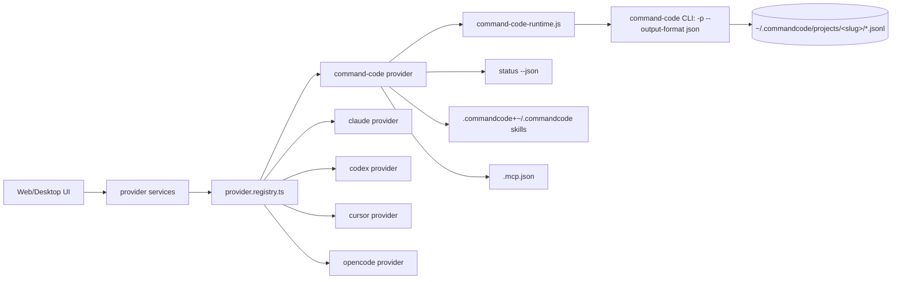

# Architecture Spine — Command Code Provider

## Design Paradigm

**Registry-keyed provider facets.** Each backend CLI is one directory
(`server/modules/providers/list/<id>/`) exposing a fixed set of facet objects (`auth`,
`models`, `runtime`, `sessions`, `sessionSynchronizer`, `mcp`, `skills`) that all implement
shared interfaces. A composition-root class (`<Provider>Provider`) wires them and registers in
`provider.registry.ts` under its provider id. Consumers (services, routes, UI) address
providers **only by id through the registry/typed unions** — never by per-provider branches
outside a provider's own directory.

Command Code is a **per-project-JSONL-session sibling of claude/codex** (JSONL family), plus a
**headless-first NDJSON runtime like codex/opencode**. Its on-disk transcript grammar is its
own (flat `parentId` tree, header-only session id) — modeled on claude/codex only for *file
layout and lifecycle skeleton*, never for row-parsing semantics.

## Invariants & Rules

### AD-1 — Provider id is `command-code` [ADOPTED]

- **Binds:** all code, unions, maps, docs.
- **Prevents:** a second alias (`cmd`, `commandcode`) splitting the type union, registry, DB
  CHECK, and UI labels into two inconsistent identities.
- **Rule:** use the single literal `'command-code'` everywhere a provider id appears. Folder =
  `server/modules/providers/list/command-code/`. Extend `LLMProvider` in
  `server/shared/types.ts` AND `src/shared/types.ts` with `'command-code'`. Never introduce a
  separate `'cmd'`/`'commandcode'` variant. (Matches the npm package `command-code`; the
  Windows `cmdc` alias is only a spawn target inside the runtime, never an id.)

### AD-2 — Spawn `command-code` via cross-spawn; Windows transport contract

- **Binds:** `command-code-runtime.provider.js`, `command-code-auth.provider.ts`
  (`status --json`), any other spawn site.
- **Prevents:** a Windows/POSIX spawn fork (one truncating multi-line prompts, another
  mangling `--resume` ids through cmd.exe quoting).
- **Rule:** always invoke `command-code` (never special-case `cmdc`) through `cross-spawn` so
  `.cmd`/`.ps1` shims resolve. Pass the prompt and **all** flags as a single argv array (no
  shell string). On win32, **newline-flatten the prompt** (reuse the repo's
  `flattenPromptForWindowsShell`) and pass `--resume`/`--session` values **unquoted as
  separate argv entries**. Always set an explicit `cwd` (plus an explicit directory flag where
  the CLI owns workspace resolution, mirroring opencode's `--dir`).

### AD-3 — Command Code is a JSONL-per-session provider (claude/codex file family, not opencode)

- **Binds:** `sessions`, `sessionSynchronizer`, `fork` (if added), DB `jsonl_path` handling,
  sessions-watcher.
- **Prevents:** treating it like opencode's shared single SQLite store (which would wrongly
  null `jsonl_path` and forbid per-session delete).
- **Rule:** transcripts live at `~/.commandcode/projects/<slug>/<id>.jsonl` (verified live).
  `createSession` carries a real `jsonlPath`. `sessionSynchronizer` scans
  `~/.commandcode/projects/**/*.jsonl`. Model the synchronizer/sessions facets on the **claude**
  provider (per-file JSONL, sidecar `.meta.json` titles) and the codex provider (headless
  NDJSON history).

### AD-4 — Auth state comes from `command-code status --json`

- **Binds:** `command-code-auth.provider.ts`.
- **Prevents:** hand-parsing `~/.commandcode/auth.json` (a private, versioned shape) or trusting
  a single exit code.
- **Rule:** auth `getStatus()` runs `command-code status --json` (exit 3 = not authenticated per
  the CLI contract). `authenticated:true` + `user` → authenticated. On ENOENT → `installed:false`,
  treated as data. This is reality-checked: `status --json` returns
  `{"authenticated":true,"version":"1.45.0","user":"...","model":"..."}` here (also carries a
  forward-compatible `context_window`). A test must cover the not-authenticated path (stub
  `authenticated:false`); when the JSON body and exit code conflict, `authenticated:false` in
  the body wins.

### AD-5 — Model catalog is curated; active model from the transcript tail

- **Binds:** `command-code-models.provider.ts`, `sessions`.
- **Prevents:** scraping `command-code --list-models` (human "Available models · N models"
  grouped output, not machine-parseable) or inventing model ids at runtime.
- **Rule:** maintain a source-controlled `ProviderModelsDefinition` of valid model ids (verified
  from the docs' exact catalog, e.g. `deepseek/deepseek-v4-flash`). Resolve the active model
  for a resumed session by reading the **newest assistant message's `model` from the transcript
  tail** — the live `<id>.meta.json` carries only `traceIds`+`title`, no model key. `meta` is a
  fallback only. A stale curated id is a user-visible `-m` launch failure (docs: unknown ids
  rejected), so keep the catalog current in the implementing story.

### AD-6 — Headless runtime = `command-code -p` + NDJSON; session-id claim is mid-stream

- **Binds:** `command-code-runtime.provider.js`, `sessions.service` interplay.
- **Prevents:** a run-end-only id capture that leaves a window with no row mapping / empty
  history, and double/racing claims against the synchronizer.
- **Rule:** spawn `command-code -p <prompt> --output-format json` with session/context flags
  (`--resume <id>` / `--continue`, `-m`, `--effort`, `--permission-mode`, `--max-turns`,
  `--no-auto-update`). Parse **newline-delimited JSON**: event frames
  (`{"type":"event","event":{...}}`) → `normalizeMessage`; the final result line
  (`{"type":"result","subtype","sessionId","usage","finalText",...}`) → terminal + token usage.
  **The runtime owns the app↔native session mapping and claims it the moment the first streamed
  event/result discloses the native id** (via `ws.setSessionId` / a `session_created` event),
  mirroring codex/opencode — NOT only at run end. Adopt the codex/opencode guarded lifecycle
  skeleton (one `complete` per run, abort idempotence). Map exit codes per AD-12.

### AD-7 — Transcript grammar: flat `parentId` list, header-only session id, linearized active branch

- **Binds:** `command-code-sessions.provider.ts` (`normalizeMessage`, `fetchHistory`),
  `sessionSynchronizer`, models, any future search parser.
- **Prevents:** a claude-style graph-prune reader dropping the whole transcript (no per-row
  `sessionId`) or a codex-style blind linear replay stacking `/fork` continuations.
- **Rule:** the on-disk file is a flat append-only list: one header row
  `{"type":"session","version":3,"id":<uuid>,"cwd":...}` (the **only** place the session id
  lives) followed by `{"type":"message","id":<row-id>,"parentId":...,"message":{role,content,
  model,usage,...}}` rows. `fetchHistory` returns the **active branch = the longest chain
  following `parentId` from the last row, preferring later siblings** — a linearization, never
  a graph prune of older prompts. Row identity for anchors is the row `id` (stable across
  reads). Never require a per-row `sessionId`. (Verified live: this is the actual grammar.)

### AD-8 — Sidecar `.jsonl` files are never sessions

- **Binds:** `sessionSynchronizer`, `sessions-watcher.service.ts` `isWatcherTargetFile`,
  delete paths.
- **Prevents:** ingesting `*.checkpoints.jsonl` / `*.prompts.jsonl` sidecars (which end in
  `.jsonl` and share the session id) as standalone sessions, overwriting the parent row's
  `jsonl_path` — the exact corruption claude's synchronizer filters against.
- **Rule:** a file under `~/.commandcode/projects/**` is a session **only if** it matches
  `<session-id>.jsonl` AND its first line is a header with `type === "session"`. Ignore
  `*.meta.json`, `*.share.json`, `*.checkpoints.jsonl`, `*.prompts.jsonl`, and anything under
  `projects/<slug>/mcp.json`. Mirror claude's `isSubagentTranscript` guard as an
  `isCommandCodeSessionTranscript` guard in both the scan and the single-file watcher path.
  Deleting a session also deletes its sidecars (`.meta.json`, `.checkpoints.jsonl`,
  `.share.json`, `.prompts.jsonl`) to avoid orphan re-import.

### AD-9 — MCP is Claude-shape top level, but per-server discriminator is `transport`

- **Binds:** `command-code-mcp.provider.ts`.
- **Prevents:** a literal claude-mcp copy that writes `type` keys Command Code won't read.
- **Rule:** read/write `.mcp.json` (project), `~/.commandcode/mcp.json` (user), and the private
  "local" scope at `~/.commandcode/projects/<slug>/mcp.json`. Top level is
  `{"mcpServers":{...}}` (shared with claude), but **Command Code's per-server entries use a
  `transport` discriminator, not `type`** — write `{"transport":"stdio|http", ...}` (with
  `command`/`url` per transport). Read `type` only as a legacy alias. Official transports are
  `stdio` and `http`; treat `sse` as legacy. This is a field-map layer over claude-mcp, not a
  copy.

### AD-10 — Runtime/UI registration is id-driven, additive, and compile-time-enforced

- **Binds:** every hardcoded provider enumeration (backend + frontend), registration points.
- **Prevents:** a provider that compiles but never appears (forgotten registry/routes entry) or
  a hardcoded list that silently omits it — including the frontend's static per-provider
  fallback matrices that render before the capability API resolves.
- **Rule:** add `command-code` to every enumerated site from the requirements doc's blast-radius
  checklist (backend: `LLMProvider` unions, `provider.registry.ts`, `provider.routes.ts`
  `parseProvider`, `provider-capabilities.service.ts`, `session-synchronizer.service.ts`
  counters, `sessions-watcher.service.ts`, `agent.routes.ts`, `commands.routes.ts`,
  `shell-websocket.service.ts`, `schema.ts` CHECK; frontend: `LLMProvider` union, `constants.ts`
  MCP maps, `selectedProvider.ts`, `useChatProviderState.ts` fallback maps, provider
  logos/labels/i18n). **Convert this from a checklist to a constraint:** derive the backend
  `parseProvider` allow-list and the frontend provider lists from a single shared
  `PROVIDER_IDS`/registry source so an incomplete `Record<LLMProvider, ...>` is a **compile
  error** (`satisfies Record<LLMProvider, ...>`), and add a route-level integration test
  asserting `GET /capabilities` and `parseProvider` cover every `LLMProvider`. Add `command-code`
  to `provider-token-usage.service.ts` per-provider dispatch (read per-assistant-line `usage`
  from the transcript tail) and to `notification-orchestrator.service.js` `PROVIDER_LABELS`
  (fix the existing opencode omission while there).

### AD-11 — Capability matrix and permission vocabulary are fixed, frontend-typed

- **Binds:** `provider-capabilities.service.ts` entry, runtime `--permission-mode` translation,
  frontend fallback matrices.
- **Prevents:** a UI offering modes the CLI rejects, or CLI modes the frontend's
  `PermissionMode` union cannot hold (the union is
  `'default'|'acceptEdits'|'auto'|'bypassPermissions'|'plan'` — NOT the CLI's vocabulary).
- **Rule:** the capability matrix publishes values in the **frontend `PermissionMode` union**,
  and the **runtime owns the only translation table** to the CLI's `--permission-mode`
  vocabulary (`auto-accept`, `dont-ask`, `plan`, `standard`/`default`). Pin the mapping:
  `acceptEdits` → `--permission-mode auto-accept`, `bypassPermissions` → `--yolo`
  (`dont-ask`), `plan` → `--plan`, `default`/`auto` → `--permission-mode default`. A UI value
  may map to only one CLI value (no silent aliasing). Fix the capability flags for
  `command-code` explicitly: `supportsImages:false` and `supportsFiles:false` (the CLI has **no
  `-p` attachment flag — offering upload would render a control whose payload has no vehicle);
  `supportsPermissionRequests:false` (headless has no interactive prompt channel — permission
  is set pre-launch via `--permission-mode`/`--yolo`); `supportsTokenUsage:true` (read the
  transcript-tail `usage`, via the AD-10 token-usage branch); `supportsAbort:true`;
  `supportsEffort:true` (vocabulary `low|medium|high` matching the catalog's effort values);
  `supportsMessageEditing:false`, `supportsSessionForking:false` for now (see Deferred). Keep
  the frontend `FALLBACK_*` matrices and the backend matrix in lockstep.

### AD-12 — Exit codes map to typed wire semantics; max-turns (8) is a distinct stop reason

- **Binds:** `command-code-runtime.provider.js`, `createCompleteMessage`, frontend run-status
  derivation.
- **Prevents:** exit-8 being rendered as either a hard error or a plain success depending on
  which builder wrote the runtime (the repo derives `success = exitCode === 0`).
- **Rule:** map exit codes: 0 ok; 3/4/5/6/7/9/10 → typed error (`complete` with
  `exitCode` set, `success:false`, plus a mid-run `error` message like codex/opencode); 130 →
  aborted. **Exit 8 (max-turns) is not an error**: emit a `status`/notice message AND
  `complete{exitCode:8, success:true}` (the run produced a valid partial result) — OR extend
  the shared complete contract with a typed `stopReason:'max_turns'`. Pick the `stopReason`
  extension if the frontend must distinguish max-turns from a normal end; otherwise pin the
  `success:true` + status-message form so both builders serialize identically.

### AD-13 — Session-row ownership: runtime claims app-launched rows; synchronizer defers

- **Binds:** `command-code-runtime.provider.js`, `command-code-session-synchronizer.provider.ts`,
  `sessions-watcher.service.ts`, DB row lifecycle.
- **Prevents:** two owners of one session row (synchronizer re-upserting on watcher `change`
  mid-run while the app streams the same file → bumping sidebar rows, or delete-by-path
  unlinking a live transcript).
- **Rule:** the session row for an app-launched run is **owned by the runtime claim**
  (`assignProviderSessionId`); the synchronizer may insert a native-keyed row **only when no
  row and no pending app session exists for `(cwd, provider)`** (resolve via
  `findLatestPendingAppSession`, mirroring opencode). The watcher must not re-upsert a row
  whose `jsonl_path` belongs to a currently-running app session (`chatRunRegistry`), and must
  treat a `change` on a live transcript as a non-event. Deleting a session while its run is
  live is refused (or aborts the run first).

## Consistency Conventions

| Concern | Convention |
| --- | --- |
| Provider id | Literal `'command-code'` in all unions/maps/DB; no `cmd`/`commandcode` alias |
| Folder / files | `server/modules/providers/list/command-code/command-code{,-runtime,-auth,-models,-mcp,-skills,-sessions,-session-synchronizer}.provider.{ts,js}` |
| Windows transport | Spawn `command-code` via cross-spawn; argv array; newline-flatten prompt on win32; unquoted `--resume`/`--session` argv |
| Runtime output grammar | NDJSON event frames + one final `result` line; forward-compatible unknown `event.type` |
| Exit-code semantics | 0 ok, 8 max-turns (non-error → AD-12), 3/4..10 typed errors, 130 interrupted |
| Session files | `~/.commandcode/projects/<slug>/<id>.jsonl` only (header `type:"session"`); sidecars never sessions |
| Auth detection | `command-code status --json` only |
| Skills | `SKILL.md`, prefix `/`, `.commandcode/skills` > `.agents/skills` priority (repo lives on `.agents/skills`) |
| MCP | Claude-shape top level; per-server `transport` discriminator; scopes user/project/local; stdio/http (+sse legacy) |
| Permissions | Frontend `PermissionMode` union published by matrix; runtime owns the CLI translation (AD-11) |
| Standards | TS only in `server/modules/`, barrel imports, shared types in `server/shared`, thin routes (backend-module-standards) |

## Stack

| Name | Version |
| --- | --- |
| Command Code CLI (`command-code`; Windows `cmdc` alias) | 1.45.0 (verified live) |
| Node (runtime shim resolution) | 22 (repo) |
| Existing provider stack | claude / codex / cursor / opencode facets (unchanged) |

## Structural Seed

```text
server/modules/providers/list/command-code/
  command-code.provider.ts                     # composition root (extends AbstractProvider)
  command-code-runtime.provider.js             # headless NDJSON spawn/abort engine
  command-code-auth.provider.ts                # status --json install/auth probe
  command-code-models.provider.ts              # curated catalog + active-model-from-transcript-tail
  command-code-mcp.provider.ts                 # .mcp.json read/write (transport discriminator)
  command-code-skills.provider.ts              # Agent-Skills roots, prefix '/'
  command-code-sessions.provider.ts            # NDJSON normalize + JSONL linearized history
  command-code-session-synchronizer.provider.ts# ~/.commandcode/projects scan -> DB (sidecar-safe)
```



## Capability → Architecture Map

| Capability / Area | Lives in | Governed by |
| --- | --- | --- |
| Session list/history | `command-code-sessions.provider.ts` | AD-3, AD-7 |
| Session sidebar sync | `command-code-session-synchronizer.provider.ts` | AD-3, AD-8, AD-13 |
| Live run / abort | `command-code-runtime.provider.js` | AD-2, AD-6, AD-12 |
| Auth status | `command-code-auth.provider.ts` | AD-4 |
| Model picker | `command-code-models.provider.ts` | AD-5 |
| Skills | `command-code-skills.provider.ts` | AD-7 (consistency) |
| MCP servers | `command-code-mcp.provider.ts` | AD-9 |
| Token usage | `provider-token-usage.service.ts` | AD-10 |
| Registration | registry/routes/unions/capabilities | AD-1, AD-10 |
| Permission modes | capability matrix + runtime | AD-11 |
| Session-row lifecycle | runtime + synchronizer + watcher | AD-13 |
| DB schema | `server/modules/database/schema.ts` | AD-10 (migration) |
| Search / notifications / git / sandbox subsets | cross-cutting | AD-11 (consistency), AD-10 (labels) |

## Deferred

- **Session forking / editing hooks** (`IProviderFork`, `resolveEditAnchor`, `rewindSession`) —
  Command Code supports `/fork` and resumable sessions, but headless editing-anchor parity is
  unproven; add only if a story needs it. If deferred, the fork route must return an explicit
  "not supported for command-code" (capability-gated like cursor/opencode), never a generic 500.
- **Command Code in conversation search** — search currently parses claude+codex native JSONL;
  Command Code's flat-`parentId` JSONL would need a parser (now well-defined by AD-7). Defer
  until there is user evidence.
- **Command Code in the git commit-message generator / cli sandbox** — deliberately narrower
  subsets. Defer.
- **Curated model list maintenance** — the catalog will drift; a future live-source mechanism is
  possible. Note the drift fails loudly (`-m` rejects unknown ids), so keep it current. Defer
  the automation.
- **Operational envelope (deploy/env)** — a feature inside an existing self-hosted app; no new
  deployment dimension. Defer.

## Open Questions (for the implementing story / architect review)

1. **Tree→linear "current pointer" after rewind.** Docs say rewinds persist, but the live
   `.meta.json` shows no pointer and the file has no rewind rows. Empirically confirm where the
   active-branch pointer lives after a `/rewind` before finalizing AD-7's linearization. If
   Command Code's file is append-after-rewind with no pointer, AD-7's "longest chain from the
   last row" is the best available rule — but verify against a real rewind.
2. **`stopReason` extension vs `success:true`+status for exit 8** (AD-12): choose one based on
   whether the frontend must visually distinguish max-turns.
3. **Electron/desktop surfaces** — verify whether `electron/` enumerates provider logos/commands
   and needs a `command-code` entry (not yet in the blast radius); add to AD-10 or explicitly
   defer.

---

## Appendix: Working memlog (decisions & evidence)

_`uv` memlog.py unavailable on this host; decisions recorded inline (headless fallback)._

| # | Type | Entry |
| --- | --- | --- |
| 1 | evidence | Live `~/.commandcode/projects/d-rn-d-claudecodeui-contrib/` exists → per-project JSONL session store confirmed. |
| 2 | evidence | `command-code --version` → 1.45.0 (auto-updater active → pass `--no-auto-update`). |
| 3 | evidence | `command-code status --json` → `{authenticated:true, user:"asiqur-rahman", model:"deepseek/deepseek-v4-flash", context_window:1000000}` → AD-4. |
| 4 | evidence | `--list-models` prints human "Available models · 67 models" grouped text → AD-5 curated. |
| 5 | evidence | Windows shims `command-code.ps1` / `cmdc.ps1` → AD-2 cross-spawn + argv/flatten. |
| 6 | evidence | Live transcript: header `{type:"session",id,cwd}` + flat `{type:"message",id,parentId}` rows; NO per-row `sessionId`; `.meta.json` = `traceIds`+`title` only (no model) → AD-5, AD-7. |
| 7 | evidence | `.checkpoints.jsonl` sidecar exists live beside the transcript → AD-8. |
| 8 | evidence | Repo runs on `.agents/skills` (project skills live there), not `.commandcode/skills` → corrected AD-7 evidence. |
| 9 | evidence | claude synchronizer guards `subagents/`/`tool-results/`; claude-mcp writes `type`; codex runtime captures session id mid-stream via `session_created`; frontend `PermissionMode` = `default|acceptEdits|auto|bypassPermissions|plan` → AD-6/8/9/11 grounded. |
| 10 | decision | Provider id `command-code`, no alias (AD-1). |
| 11 | decision | JSONL-per-session, claude/codex file family, not opencode (AD-3). |
| 12 | decision | Runtime owns app↔native mapping, claims mid-stream (AD-6). |
| 13 | decision | Transcript grammar = flat parentId list; linearized active branch (AD-7). |
| 14 | decision | Sidecars are never sessions (AD-8). |
| 15 | decision | MCP per-server `transport` discriminator (AD-9). |
| 16 | decision | Registration enforced as compile-time constraint + integration test (AD-10). |
| 17 | decision | Capability flags + permission translation table fixed (AD-11). |
| 18 | decision | Exit-8 = non-error, distinct stop reason (AD-12). |
| 19 | decision | Session-row ownership: runtime claims, synchronizer defers (AD-13). |
| 20 | assumption | Command Code's NDJSON `result` line is the only terminal event; `event` frames are forward-compatible. |
| 21 | question | Rewind pointer persistence needs empirical confirmation (Open Questions 1). |
